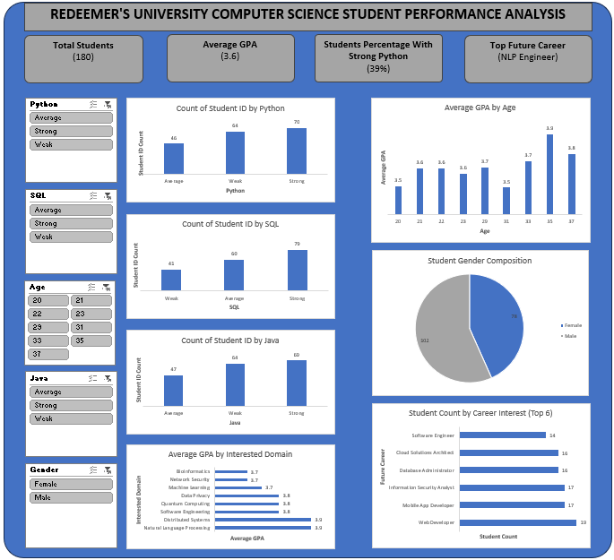

# COMPUTER SCIENCE STUDENTS’ ACADEMIC PERFORMANCE ANALYSIS AT REDEEMER’S UNIVERSITY

## Table of Contents

- [Project Overview](#project-overview)
- [Data Source](#data-source)
- [Tool](#tool)
- [Data Cleaning](#data-cleaning)
- [Exploratory Data Analysis](#exploratory-data-analysis)
- [Data Analysis](#data-analysis)
- [Insights](#insights)
- [Recommendations](#recommendations)
- [Limitations](#limitations)

### Project Overview

This report presents an analysis of a dataset on the academic performance of Computer Science students at Redeemer’s University.
Redeemer’s University is a private Christian institution committed to academic excellence, innovation, character development, and impactful research. The university provides a conducive learning environment that fosters intellectual growth, ethical values, and practical skills across various disciplines, including Computer Science.

The primary purpose of this analysis is to identify the factors associated with academic success among Computer Science students and provide data-driven insights that can support evidence-based decision making. The findings are intended to assist the university management, lecturers etc. in developing strategies that enhance student learning, improve academic performance, and strengthen the overall quality of education within the Department of Computer Science.

### Data Source

The dataset used for this analysis was sourced from Kaggle. The dataset contains 180 student records and 12 variables.
Each entry includes:
-	Demographics: Age, Gender
-	Academic Info: GPA, Major, Interested Domain, Python, SQL, Java
-	Career: Future Career interest
 
### Tool

- Excel

### Data Cleaning

In the initial data preparation phase, I performed the following tasks:
1. Duplicate Check and Removal: I checked the dataset for duplicate records using the Remove Duplicates feature in the Data tab. No duplicate records were found in the dataset.
 
2. Blank Space Detection: I checked for blank cells using the New Formatting Rule option under Conditional Formatting in the Home tab. No blank cells were found.
3. Column Formatting: I removed the column named Major cause it was a repetition. I also bolden all the column headers for clearer visibility.

##### KPI POINTS
-	I used COUNT function to find the total population.
-	I used AVERAGE function to find the average GPA.
-	I used COUNTIF and COUNTA function to find the number of “STRONG” python and converted it to percentage.
 
### Data Transformation
I transformed the dataset by creating the Grade column using the IF function.

### Exploratory Data Analysis

EDA involved exploring the student data to answer key questions, such as:

- How are students distributed by programming skill level (Python, SQL, Java)?
- Does area of academic interest (domain) have an effect on students' GPA?
- What effect does age have on students' GPA?
- What is the gender distribution of the student population?
- What are the most popular future career interests among students?

### Data Analysis

**1. Programming Skill Distribution**
- Python: 70 Strong · 64 Weak · 46 Average

- SQL: 79 Strong · 60 Average · 41 Weak

  
- Java: 69 Strong · 64 Weak · 47 Average

  

**2. GPA by Interested Domain**
- Average GPA stays consistent across domains, roughly 3.5–3.9
- Distributed Systems and NLP post the highest average GPAs (~3.9)

**3. GPA by Age**
- Students aged 33–37 have the highest average GPAs
- Students around age 20 and 31 have the lowest average GPAs

**4. Gender Distribution**
- Male : Female ratio is 102 : 78 — the sample skews male

**5. Career Interest**
- Web Developer is the most popular career interest (19 students)
- Software Engineer is the least popular (14 students)

### Insights

The analysis results are summarized as follows:
1. **Skill self-ratings cluster at the extremes.** Across Python, SQL, and Java, students mostly rate themselves "Strong," with "Weak" outpacing "Average" in Python and Java. SQL is the exception, more students land in the "Average" bracket, suggesting more moderate confidence with that language specifically.
2. **Academic interest has limited effect on GPA.** Since GPA hovers in a fairly tight band (3.5–3.9) across all domains, choice of specialization doesn't appear to be a strong driver of performance, other factors matter more.
3. **Age correlates with performance.** The 33–37 age group significantly outperforms the 20 and 31 age groups, which could reflect maturity, work experience, or more focused study habits in older students, worth exploring further with additional data.
4. **The dataset skews male (57%).** Any overall trend should be read with this imbalance in mind, since it more heavily reflects male students' outcomes than a balanced population.
5. **Web Development leads career interest**, followed by Mobile App Development and Information Security. A useful signal for where to focus curriculum and internship placement.

### Recommendations

Based on the analysis, we recommend the following actions:
- Run targeted Python/Java bootcamps for the ~64 students self-rated "Weak" in each language; use graded assessments rather than self-ratings to track real progress.
- Expand electives and mentorship in Distributed Systems and NLP, the top-GPA domains.
- Pair lower-GPA age groups (20, 31) with the highest-performing 33–37 cohort as mentors; add first-year advising check-ins.
- Invest in female enrollment growth (currently 78/180) through scholarships and STEM outreach; track the ratio annually.
- Prioritize curriculum and internship pipelines around Web Dev, Mobile App Dev, and InfoSec.
- Collect attendance and weekly study-hours data going forward to strengthen future GPA prediction.

### Limitations

- Time constraints: The report notes this is the main limitation impacting the analysis (less time for deeper exploration, cross-referencing, or extra variables).
- Self-reported skill ratings: Python/SQL/Java levels are students' own assessments ("Strong/Average/Weak"), not test-based scores, so they reflect confidence more than verified ability.
- Missing variables: No attendance or study-hours data was collected, which the report itself flags as a gap for predicting GPA more accurately (this is also called out in the Recommendations).
- Sample skew: The gender split (102 male : 78 female) means findings may not generalize evenly across the student population.
